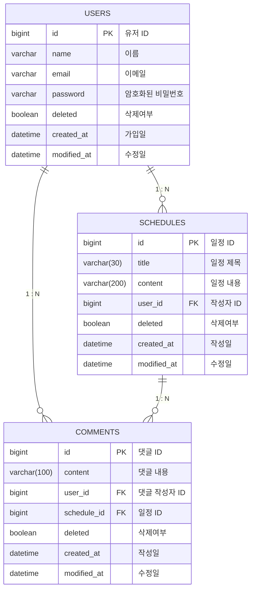

# 📆 Schedule-App (일정 관리 앱)

이 프로젝트는 **Spring Boot 기반 RESTful 서버**로,  
회원가입과 로그인을 통해 사용자를 인증하고, 
인증된 사용자만이 일정(Schedule)과 댓글(Comment)을 
작성, 수정, 삭제할 수 있는 기능을 갖춘 **일정 관리 애플리케이션**입니다.

---

## 🧱 프로젝트 개요

- Spring Boot 3.x
- JPA (Hibernate)
- MySQL
- 세션 기반 인증
- 계층 구조 분리: Controller → Service → Repository
- DTO 기반 요청/응답 (Entity 직접 노출 방지)

---

## 📋 API 명세서 (API Specification)

**Common Info**
- **Session Auth**: 대부분의 `POST`, `PUT`, `PATCH`, `DELETE` 요청은 로그인(`HttpSession`)이 필요합니다.
- **Base URL**: `/schedules/{scheduleId}/comments` (댓글 API는 일정 ID에 종속적입니다)

### 1. 유저 (User) API

| 기능 | Method | URL | Request Body | Response | 비고 |
| :--- | :---: | :--- | :--- | :--- | :--- |
| **회원가입** | `POST` | `/users/signup` | `name`, `email`, `password` | `id`, `name`, `email`, `createdAt` | 비밀번호 암호화 저장 |
| **로그인** | `POST` | `/users/login` | `email`, `password` | - | **Session 생성** (Status 200) |
| **유저 전체 조회** | `GET` | `/users` | - | List of `GetUserResponse` | - |
| **유저 단건 조회** | `GET` | `/users/{userId}` | - | `id`, `name`, `email`, `createdAt`... | - |
| **유저 정보 수정** | `PUT` | `/users/{userId}` | `name`, `email` | `id`, `name`, `email`... | **본인만 수정 가능** |
| **유저 탈퇴** | `DELETE` | `/users/{userId}` | - | - | **Soft Delete** (Status 204) |

### 2. 일정 (Schedule) API

| 기능 | Method | URL | Request Body | Response | 비고 |
| :--- | :---: | :--- | :--- | :--- | :--- |
| **일정 등록** | `POST` | `/schedules` | `title`, `content` | `id`, `title`, `content`, `createdAt` | 로그인 필요 |
| **일정 페이징 조회** | `GET` | `/schedules` | - | List of `GetPageResponse` | `?page=0&size=10` 댓글 개수 포함 반환 |
| **일정 단건 조회** | `GET` | `/schedules/{scheduleId}` | - | `id`, `title`, `content`, `comments` | **댓글 목록 포함** |
| **일정 수정** | `PATCH` | `/schedules/{scheduleId}` | `title`, `content` | `id`, `title`, `content`... | **작성자 본인만 가능** |
| **일정 삭제** | `DELETE` | `/schedules/{scheduleId}` | - | - | **Soft Delete** (Status 204) |

### 3. 댓글 (Comment) API
*(경로: `/schedules/{scheduleId}/comments`)*

| 기능 | Method | URL | Request Body | Response | 비고 |
| :--- | :---: | :--- | :--- | :--- | :--- |
| **댓글 등록** | `POST` | `/` | `content` | `id`, `content`, `createdAt` | **일정당 최대 10개 제한** |
| **댓글 전체 조회** | `GET` | `/` | - | List of `GetCommentResponse` | 해당 일정의 모든 댓글 조회 |
| **댓글 단건 조회** | `GET` | `/{commentId}` | - | `id`, `content`, `createdAt` | - |
| **댓글 수정** | `PUT` | `/{commentId}` | `content` | `id`, `content`, `modifiedAt` | **작성자 본인만 가능** |
| **댓글 삭제** | `DELETE` | `/{commentId}` | - | - | **Soft Delete** |

---

## 🛠️ ERD (Entity Relationship Diagram)

---

## 💡 주요 기능 및 로직 설명 (Feature & Logic)

### 1. 엔티티 구조 및 연관관계 (Entity Structure & Relationships)
현재 코드는 **`@ManyToOne`을 활용한 단방향 매핑** 위주로 설계되어 있어, 객체 참조가 직관적이고 순환 참조 문제를 방지합니다.

- **User (사용자)**
    - 시스템의 핵심 주체입니다. 일정(`Schedule`)과 댓글(`Comment`) 엔티티에서 `user_id`를 통해 참조됩니다.
    - `@SQLDelete`가 적용되어 있어 탈퇴 시 물리적 삭제 대신 `deleted = true` 상태로 변경됩니다.
- **Schedule (일정)**
    - **User와 N:1 관계**: 하나의 유저는 여러 일정을 가질 수 있습니다. `Schedule` 엔티티가 `User` 객체를 `@ManyToOne`으로 가지고 있습니다.
    - **Comment와 1:N 관계 (논리적)**: 실제 코드상 `List<Comment>` 필드는 없지만, `Comment`가 `schedule_id`를 가짐으로써 관계가 형성됩니다.
- **Comment (댓글)**
    - **User와 N:1 관계**: 누가 작성했는지(`user_id`)를 관리합니다.
    - **Schedule과 N:1 관계**: 어떤 일정(`schedule_id`)에 달린 댓글인지 관리합니다.
- **BaseEntity (공통)**
    - 모든 엔티티는 `BaseEntity`를 상속받아 생성일(`createdAt`)과 수정일(`modifiedAt`)을 자동으로 관리(JPA Auditing)합니다.

### 2. 인증 및 인가 (Authentication & Authorization)
- **세션 기반 로그인:** `HttpSession`을 사용하여 로그인 상태를 관리합니다. `LoginRequest`가 성공하면 세션에 사용자 정보(`SESSION_USER`)를 저장하고, 이후 요청에서 이를 확인합니다.
- **비밀번호 암호화:** `PasswordEncoder`를 도입하여 회원가입 시 비밀번호를 암호화하여 DB에 저장, 보안성을 강화했습니다.
- **권한 검증:** `UserCommonValidationService` 등을 통해 게시글이나 댓글 수정/삭제 시 **"현재 로그인한 유저"**와 **"작성자"**가 일치하는지 엄격하게 검증합니다.

### 3. 데이터 관리 (Soft Delete & Auditing)
- **Soft Delete (논리적 삭제):** 데이터를 DB에서 완전히 지우는 `HARD DELETE` 대신, `deleted = true` 플래그를 설정하여 데이터를 보존하는 `SOFT DELETE` 방식을 적용했습니다.
    - 구현: 엔티티에 `@SQLDelete(sql = "UPDATE ... SET deleted = true ...")`와 `@SQLRestriction("deleted = false")`를 적용하여 삭제된 데이터는 조회되지 않도록 처리했습니다.
- **JPA Auditing:** `BaseEntity`를 상속받아 모든 엔티티의 생성일(`createdAt`)과 수정일(`modifiedAt`)을 자동으로 기록합니다.

### 4. 페이지네이션 및 정렬 (Pagination & Sorting)
- **목적:** 데이터가 많아질 경우 전체 데이터를 한 번에 조회하는 것은 비효율적이므로, 페이지 단위로 나누어 조회합니다.
- **구현:** `Pageable` 인터페이스를 활용하여 `page`(페이지 번호)와 `size`(페이지 당 게시글 수)를 파라미터로 받습니다.
- **정렬:** 기본적으로 **수정일(modifiedAt)** 기준 **내림차순(DESC)**으로 정렬하여 최신 수정된 일정이 가장 먼저 보이도록 합니다.

### 5. 비즈니스 로직 및 제약 사항
- **댓글 등록 제한:** `scheduleId`를 기준으로 현재 등록된 댓글 개수를 카운트(`countByScheduleId`)하여, **10개 이상**일 경우 `IllegalArgumentException` 예외를 발생시킵니다.
- **비밀번호 검증:** 일정 및 댓글의 수정/삭제 요청 시, 요청 Body의 비밀번호와 DB에 저장된 비밀번호를 비교합니다. 불일치 시 `401 Unauthorized` 또는 커스텀 예외를 반환합니다.
- **유효성 검사 (Validation):**
    - 할일 제목: 최대 10자 이내
    - 할일 내용: 최대 200자 이내
    - 이메일: 형식을 준수해야 함 (`@Valid`, `@Email` 활용)

### 6. 예외 처리 (Exception Handling)
- **GlobalExceptionHandler**를 통해 `ServiceException`을 상속받은 커스텀 예외들을 API 전역에서 일관된 형식으로 처리합니다.
    - `UserNotFoundException`, `ScheduleNotFoundException` (데이터 없음) → 404 Not Found
    - `UnmatchPasswordException`, `UnauthorizedException` (비밀번호 불일치 및 인증 실패) → 401 Unauthorized
    - `ForbiddenUserException` (접근 권한 없음) → 403 Forbidden
    - `AlreadyExistingEmailException` (이메일 중복) → 409 Conflict

---

## 🔎 회고

### 1. 개발자적 사고와 기술적 향상
- 해당 과제를 작성하면서 다양한 예외나 중복된 코드들을 마주하며 
  - '이런 예외는 자주 일어나는 것이니 커스텀해주어야겠다.'
  - '해당 과정이 너무 많이 반복되고 있으니 따로 메서드를 만들어서 중복된 코드들을 리팩토링 해주어야겠다.'
  - '이런 메서드들이 쌓이면 하나의 객체(ex.각 API의 Service)가 너무 많은 책임을 갖는 것은 아닐까?'
  - '그러니 새로운 객체를 생성하여 책임을 분산시켜주고 더욱 객체지향적으로 코드를 작성해야겠다'
  - 위와 같은 사고를 거쳐 점점 깔끔해지는 코드에 기뻐하는 자신을 마주할 수 있었다.

### 2. 학구열의 상승
- JPA나 MySQL을 활용하여 다양한 기능을 수행할 수 있다는 것을 인지
  - 연관관계, 인증/인가, 소프트 딜리트, 페이지네이션, 예외처리 등의 다양한 기능을 구현해보니 '다음엔 어떤 더욱 강력한 기능을 학습할 수 있을까?'하는 생각이 들었다.
  - 그러한 기대로 인하여 지금 구현해본 것들을 잊지 않도록 다시 한 번 과제를 스스로 작성해볼 생각이다.

### 3. 한계체감
- 위 내용에서 긍정적으로 서술하긴 했지만, 해당 기능 들을 구현해보는 과정에서 순탄했던 것만은 아니다.
  - 구현 시작 단계부터 어디에 어떻게 적용하면 좋을 지 헤매기도 하였고, 분명히 잘 구현했다고 생각했지만 기능이 적용되지 않아 애를 먹은 적도 많았다.
  - 허나 지금으로선 이 과제를 3일 만에 해낸 나에게 칭찬을 해주고싶은 마음이다. 