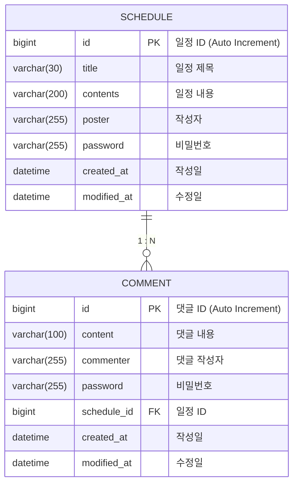

# 🗓️ 일정 관리 앱 (Schedule Management App)

일정(Schedule)을 등록, 조회, 수정, 삭제하고 일정에 대한 댓글(Comment)을 남길 수 있는 REST API 서버입니다.

## 📋 API 명세서 (API Specification)

### 1. 일정 (Schedule) API

| 기능 | Method | URL | Request Body (JSON) | Response (JSON) | 비고 |
| :--- | :---: | :--- | :--- | :--- | :--- |
| **일정 등록** | `POST` | `/schedules` | `title`, `contents`, `poster`, `password` | `id`, `title`, `contents`, `poster`, `createdAt`, `modifiedAt` | Status: 201 Created |
| **일정 전체 조회** | `GET` | `/schedules` | - | List of `[id, title, contents, poster, createdAt, modifiedAt]` | `?schedulePoster=이름`으로 필터링 가능   수정일 기준 내림차순 정렬 |
| **일정 단건 조회** | `GET` | `/schedules/{id}` | - | `id`, `title`, `contents`, `poster`, `createdAt`, `modifiedAt`, **`comments`** | 댓글 목록 포함 반환 |
| **일정 수정** | `PATCH` | `/schedules/{id}` | `title`, `poster`, `password` | `id`, `title`, `contents`, `poster`, `createdAt`, `modifiedAt` | 비밀번호 일치 시 수정 가능 |
| **일정 삭제** | `DELETE` | `/schedules/{id}` | `password` | - | Status: 204 No Content   비밀번호 일치 시 삭제 가능 |

### 2. 댓글 (Comment) API

| 기능 | Method | URL | Request Body (JSON) | Response (JSON) | 비고 |
| :--- | :---: | :--- | :--- | :--- | :--- |
| **댓글 등록** | `POST` | `/schedules/{id}` | `content`, `commenter`, `password`, `scheduleId` | `id`, `content`, `commenter`, `createdAt`, `modifiedAt` | Status: 201 Created   **한 일정당 최대 10개 제한** |

---

## 🛠️ ERD (Entity Relationship Diagram)

## 💡 주요 기능 및 로직 설명

### 1. 엔티티 구조
- **Schedule (일정):** 일정 제목, 내용, 작성자, 비밀번호를 포함합니다.
- **Comment (댓글):** 댓글 내용, 작성자, 비밀번호를 포함하며 특정 `Schedule`의 ID(`scheduleId`)를 가집니다.
- **BaseEntity:** 모든 엔티티는 생성일(`createdAt`)과 수정일(`modifiedAt`)을 자동으로 관리합니다.

### 2. 댓글 제한 로직
- 댓글 등록 시, 해당 일정에 이미 등록된 댓글 개수를 확인합니다.
- 댓글이 **10개 이상**일 경우 `IllegalArgumentException`을 발생시켜 추가 등록을 막습니다.

### 3. 비밀번호 검증
- 일정 수정(`PATCH`) 및 삭제(`DELETE`) 시 요청 Body에 담긴 비밀번호와 DB에 저장된 비밀번호를 비교합니다.
- 일치하지 않을 경우 예외를 발생시킵니다.